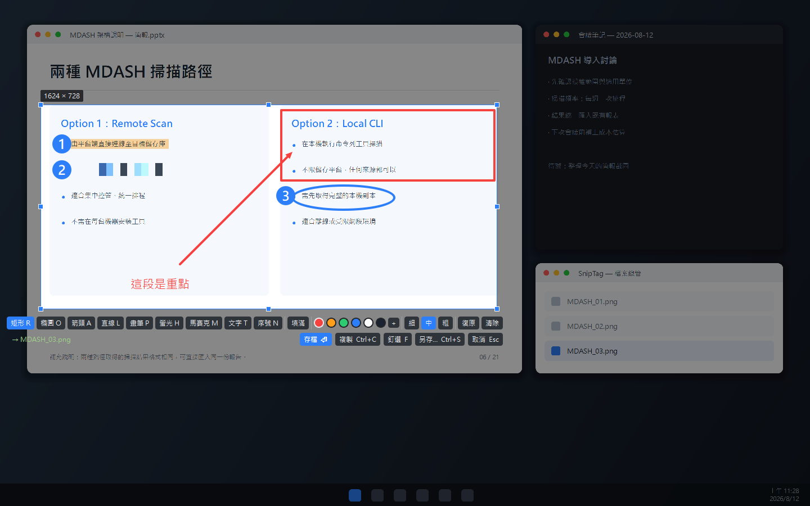
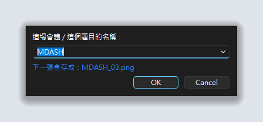
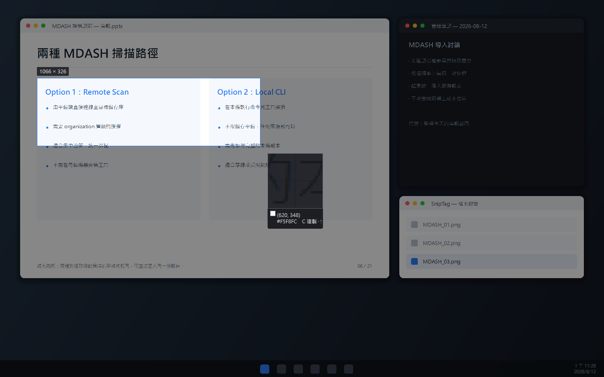
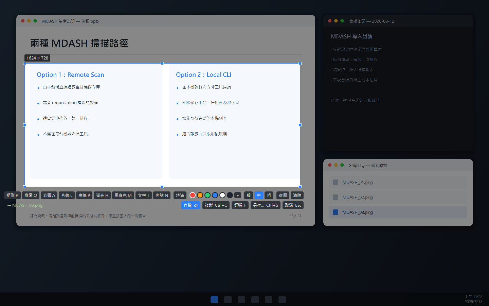
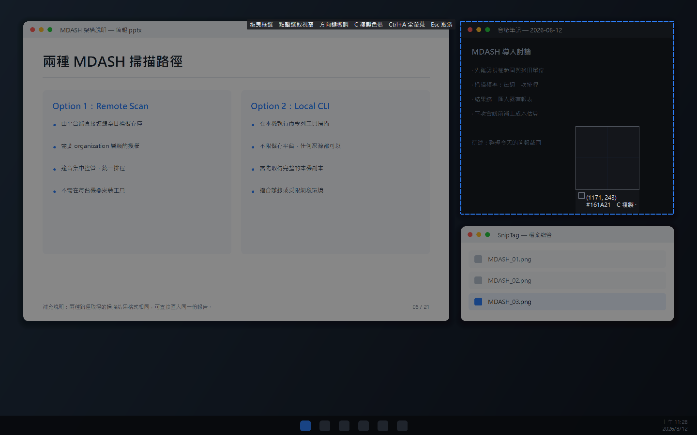
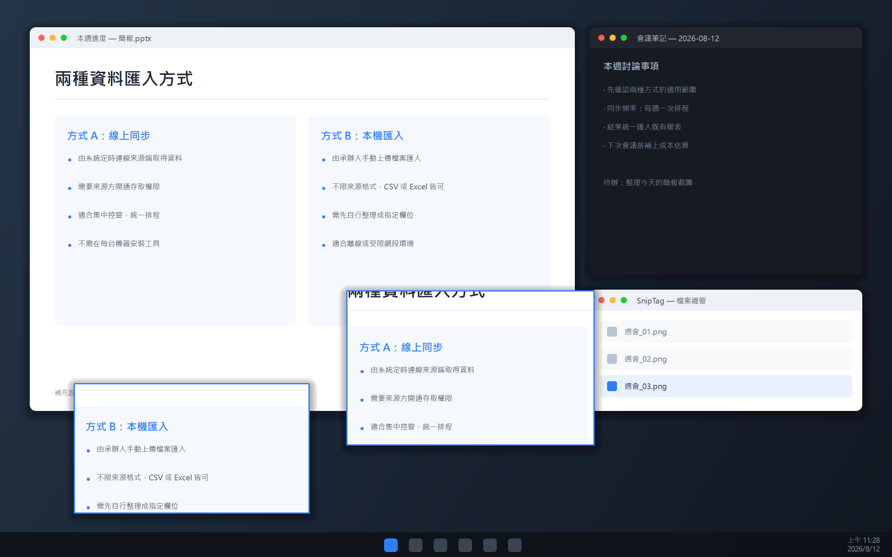
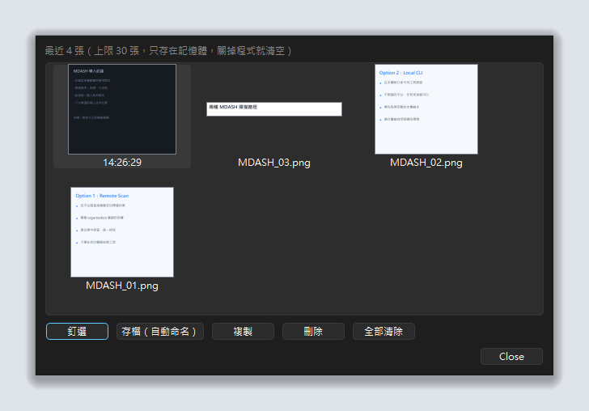
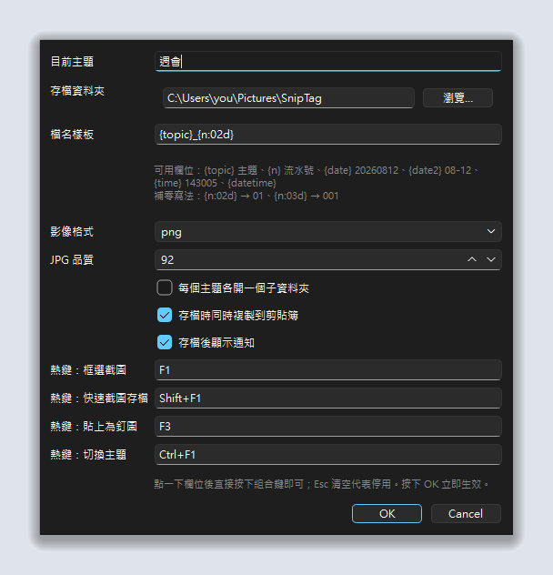

<div align="center">

# SnipTag

**先定主題，再連續截圖 —— 檔名自動接續 `MDASH_01`、`MDASH_02`、`MDASH_03`…**

一個常駐系統匣的 Windows 截圖工具。操作邏輯照著 Snipaste，
但把「開會時連續截圖、每張都要重新命名」這件事整個拿掉。

[](https://www.python.org/)
[](https://doc.qt.io/qtforpython/)
[](#系統需求)
[](LICENSE)



</div>

---

## 這個工具在解決什麼

一場線上會議，簡報一頁一頁換，你想把每一頁都留下來。

用一般的截圖工具，流程是這樣的：**框選 → 存檔對話框 → 想檔名 → 打字 → 選資料夾 → 存檔**。
一場會議三十張，光是命名就打了三十次字，而且事後看到 `擷取畫面 2026-08-12 143052.png`
根本認不出哪張是哪張。

SnipTag 把這段砍成一個動作：

```
Ctrl+F1  設定主題 → 輸入「MDASH」

Shift+F1 框一下 → MDASH_01.png   ← 放開滑鼠的瞬間就存好了
Shift+F1 框一下 → MDASH_02.png
Shift+F1 框一下 → MDASH_03.png
```

沒有對話框、沒有打字、不用選資料夾。整場會議就是「框、放、框、放」。

---

## 主要功能

|  | 功能 | 說明 |
| :-: | --- | --- |
| 🏷️ | **主題式自動命名** | 設定一次主題，之後每張截圖自動接續編號 |
| ⚡ | **零對話框存檔** | `Shift+F1` 放開滑鼠即存檔，工具列也會先告訴你下一張叫什麼 |
| 🧮 | **編號掃描資料夾決定** | 不是記在設定檔，所以換主題、重開程式、刪檔都不會亂 |
| ✏️ | **標註工具** | 矩形、橢圓、箭頭、直線、畫筆、螢光筆、馬賽克、文字、序號 |
| 🖐️ | **標註可再編輯** | 畫完還能點選、搬移、改色、刪除，不只是一路復原 |
| 🪟 | **輔助框自動偵測** | 滑鼠移到哪就框住哪，連視窗裡的子區塊都認得，點一下即選取 |
| 🎨 | **取色器** | 放大鏡顯示色碼，`C` 複製，`Shift` 切換 HEX / RGB / HSL |
| 🕘 | **截圖歷史** | 最近 30 張隨時叫回來重新存檔、複製、釘選 |
| 🔍 | **像素放大鏡** | 顯示游標座標與該點色碼，方便精準對齊 |
| 📌 | **釘圖到桌面** | 把截圖釘在最上層，可縮放、調透明度，對照資料很好用 |
| 🖥️ | **混合 DPI 多螢幕** | 筆電 200% + 外接 100% 也不偏移，各自以原生解析度存檔 |
| ⌨️ | **全域熱鍵** | 任何程式在前景都能觸發，熱鍵可自訂 |
| 📦 | **純本機執行** | 沒有網路連線、沒有帳號、沒有雲端，設定就一個 JSON |

---

## 安裝

### 系統需求

- Windows 10 / 11
- Python 3.10 以上

> 全域熱鍵與視窗偵測使用 Win32 API。在 macOS / Linux 上程式仍可啟動，
> 但熱鍵與視窗自動偵測不會作用。

### 步驟

```bash
git clone https://github.com/and910805/SnipTag.git
```

```bash
cd SnipTag
```

```bash
pip install -r requirements.txt
```

### 啟動

```bash
python -m sniptag
```

或直接雙擊 **`run.bat`** —— 用 `pythonw` 啟動，不會留一個黑色 console 視窗。

啟動後會常駐在系統匣，右鍵圖示即可叫出所有功能。

### 開機自動啟動

按 `Win`+`R` 輸入 `shell:startup`，把 `run.bat` 的捷徑丟進去。

---

## 快速上手

**1. 設定這場會議的主題** —— 按 `Ctrl+F1`，輸入 `MDASH`。
對話框會即時告訴你下一張會存成什麼。



**2. 開始截圖** —— 按 `Shift+F1`，框一下，放開滑鼠。檔案已經存好了。

想先確認再存的話按 `F1`，工具列左邊會顯示 `→ MDASH_03.png`，按 `Enter` 存檔。

**3. 換一場會議** —— 再按 `Ctrl+F1` 換個主題，編號自動從 `01` 重新開始。

---

## 使用畫面

### 框選中：暗化背景、即時尺寸、像素放大鏡

放大鏡顯示游標座標與該點色碼，尺寸標籤顯示的是**實際會存下來的像素數**。



### 框選完成：工具列直接告訴你檔名

左下角的 `→ MDASH_03.png` 就是按下「存檔」後的結果。框好之後還能拖曳邊角調整、整塊搬移。



### 標註：矩形、箭頭、螢光筆、馬賽克、文字

上排選工具與顏色粗細，畫錯了 `Ctrl`+`Z` 復原。標註是向量繪製，
輸出時才畫到原生解析度上，所以在高 DPI 螢幕也不會糊。


### 輔助框：滑鼠移過去，點一下就好

不用手動對齊邊界。除了整個視窗，也會認出視窗裡的子區塊 —— 游標停在哪一塊就框哪一塊。



### 釘圖：把截圖釘在桌面最上層

滾輪縮放、`Ctrl`+滾輪調透明度，對照兩份資料時很方便。



### 截圖歷史：剛剛那張手滑關掉了也救得回來

最近 30 張都留著，可以重新存檔（一樣自動命名）、複製或釘選。
只放在記憶體裡，關掉程式就清空 —— 這是給「手滑」用的，不是備份機制。



### 設定



> 以上畫面由 [`docs/make_screenshots.py`](docs/make_screenshots.py) 產生，
> 內容是合成的假桌面，任何人重跑都會得到一樣的圖。

---

## 熱鍵

| 熱鍵 | 功能 |
| --- | --- |
| `F1` | 框選截圖，放開滑鼠後出現工具列 |
| `Shift+F1` | **快速截圖：放開滑鼠直接存檔**，不出工具列 |
| `F3` | 把剪貼簿裡的圖釘到桌面 |
| `Ctrl+F1` | 切換主題 |

熱鍵可在「設定…」裡改，改完需重新啟動。

### 框選中

| 操作 | 說明 |
| --- | --- |
| 拖曳 | 框出範圍 |
| 直接點一下 | 選取游標底下的視窗或子區塊 |
| 拖曳邊角 / 中間 | 框好之後調整大小、整塊搬移 |
| 方向鍵 | 微調：未框好時逐像素移動游標，框好後移動選取範圍 |
| `Ctrl`+方向鍵 / `Shift`+方向鍵 | 放大 / 縮小選取範圍（加 `Alt` 一次 10 像素） |
| `C` | 複製游標下的色碼 |
| `Shift` | 切換色碼格式（HEX / RGB / HSL） |
| `Ctrl`+`A` | 選取整個桌面 |
| `Enter` / `S` / 雙擊 | 自動命名存檔 |
| `Ctrl`+`C` | 複製到剪貼簿 |
| `F` | 釘到桌面 |
| `Ctrl`+`S` | 另存新檔（會跳對話框） |
| `Esc` | 取消 |

### 標註工具

框好之後才會出現。選了工具之後，在框選範圍內拖曳即可繪製。

| 熱鍵 | 工具 | 說明 |
| --- | --- | --- |
| `R` | 矩形 | 框住重點 |
| `O` | 橢圓 | 圈起來 |
| `A` | 箭頭 | 指向某處 |
| `L` | 直線 | |
| `P` | 畫筆 | 自由手繪 |
| `H` | 螢光筆 | 半透明加寬，底下的字還看得見 |
| `M` | 馬賽克 | 遮住機敏資訊 |
| `T` | 文字 | 點一下輸入，`Enter` 完成 |
| `N` | 序號 | 點一下蓋一個 ①，自動遞增 |

顏色（六個常用色 + `＋` 自訂）、粗細、矩形/橢圓的「填滿」都在工具列上直接選。

**畫完還能改**：不選任何工具的狀態下，點一下已完成的標註就會選取它
（外圍出現虛線框），可以拖曳搬移、按 `Delete` 刪除，或直接換顏色與粗細。

| 熱鍵 | 功能 |
| --- | --- |
| `Ctrl`+`Z` | 復原 |
| `Ctrl`+`Shift`+`Z` / `Ctrl`+`Y` | 重做 |
| 方向鍵 | 微調選中標註的位置 |
| `Delete` | 刪除選中的標註 |
| `Esc` | 取消選取 → 取消工具 → 結束截圖（依序） |

標註是**向量繪製**，輸出時才畫到原生解析度上，所以線條在高 DPI 螢幕上不會糊掉，
馬賽克也是取原始像素重新運算。

### 釘圖視窗

| 操作 | 說明 |
| --- | --- |
| 拖曳 | 移動 |
| 滾輪 / `+` `-` | 縮放 |
| `Ctrl`+滾輪 | 調透明度 |
| `1` / `2` | 向左 / 向右旋轉 90° |
| `X` | **滑鼠穿透** —— 圖留在最上層，但點擊會穿到底下的視窗 |
| `Alt`+`C` | 複製游標下的色碼 |
| `Ctrl`+`C` / `Ctrl`+`S` | 複製 / 存檔 |
| `Ctrl`+`0` | 回到原始大小、角度與不透明 |
| 右鍵 | 完整選單 |
| 雙擊 / 中鍵 / `Esc` | 關閉 |

> 開了滑鼠穿透之後，那張圖就收不到鍵盤與滑鼠了 —— 邊框會變成橘色提醒你。
> 要救回來請用系統匣選單的「解除所有滑鼠穿透」。

---

## 檔名樣板

預設樣板是 `{topic}_{n:02d}`，可在設定裡改。

| 欄位 | 產出 |
| --- | --- |
| `{topic}` | 目前主題，例如 `MDASH` |
| `{n}` | 流水號。`{n:02d}` → `01`、`{n:03d}` → `001` |
| `{date}` | `20260812` |
| `{date2}` | `08-12` |
| `{time}` | `143005` |
| `{datetime}` | `20260812_143005` |

常見組合：

| 樣板 | 結果 |
| --- | --- |
| `{topic}_{n:02d}` | `MDASH_01.png` |
| `{date2}_{n:02d}` | `08-12_01.png`（用日期當主題） |
| `{date}_{topic}_{n:03d}` | `20260812_MDASH_001.png` |

### 編號怎麼決定的

**掃描目的資料夾算出來的，不是記在設定檔裡。** 所以：

- 換主題 → 新主題自動從 `01` 開始
- 關掉程式再開 → 接著原本的號碼往下走
- 手動刪掉中間某張 → **不回填空號**，永遠接在最大號之後，不會蓋掉既有檔案
- 手動搬走整批檔案 → 下次自動從 `01` 重來

打開「每個主題各開一個子資料夾」後，會存成 `<存檔資料夾>/MDASH/MDASH_01.png`。

---

## 多螢幕與混合 DPI

支援不同縮放比例的螢幕混用 —— 例如筆電 200% 搭配外接螢幕 100%。

程式會用 Windows 的顯示裝置名稱（`\\.\DISPLAY1`）把 Qt 螢幕和 Win32 螢幕配對起來，
每台螢幕各自保留「邏輯座標 ↔ 實體像素 ↔ 縮放比」的對應關係，**不使用單一全域縮放比**。
插拔外接螢幕不需要任何設定：

- 每張截圖以該螢幕的**原生解析度**存檔，不會糊掉也不會被放大
- 框選跨越兩台螢幕時，以較高解析度那台為基準拼接
- 視窗自動偵測在兩台螢幕上都對得準

這段邏輯有獨立測試，用模擬的螢幕組態驗證，不需要真的接上外接螢幕。

---

## 設定檔

`%APPDATA%\SnipTag\config.json`

```json
{
  "save_dir": "C:\\Users\\<you>\\Pictures\\SnipTag",
  "topic": "MDASH",
  "template": "{topic}_{n:02d}",
  "format": "png",
  "subfolder_per_topic": false,
  "copy_on_save": true,
  "notify_on_save": true,
  "hotkey_capture": "F1",
  "hotkey_quickshot": "Shift+F1",
  "hotkey_pin": "F3",
  "hotkey_topic": "Ctrl+F1"
}
```

---

## 專案結構

```
sniptag/
├─ __main__.py    進入點，設定 High-DPI 政策後啟動
├─ app.py         主控制器：系統匣、熱鍵綁定、截圖流程、存檔
├─ config.py      設定讀寫
├─ naming.py      主題 + 流水號 → 檔名（掃描資料夾決定編號）
├─ screens.py     桌面擷取、逐螢幕 DPI 換算（DesktopShot）
├─ winrects.py    列舉可見視窗與子區塊（EnumWindows / EnumChildWindows + DWM）
├─ overlay.py     全螢幕框選介面
├─ annotate.py    標註圖形與圖層（含命中測試、復原）
├─ history.py     截圖歷史與瀏覽面板
├─ pinwindow.py   釘圖視窗
├─ dialogs.py     主題 / 設定視窗
├─ hotkeys.py     全域熱鍵（RegisterHotKey + native event filter）
└─ icon.py        程式內畫出來的圖示
```

核心抽象是 `screens.DesktopShot`：一次桌面擷取的結果，內含整個虛擬桌面的實體像素，
以及每台螢幕的座標對應。所有「邏輯座標 ↔ 實體像素」的換算都經過它，
其他模組不需要知道 DPI 的存在。

---

## 開發

### 測試

```bash
python test_naming.py
```

```bash
python test_dpi.py
```

```bash
python test_annotate.py
```

```bash
python test_history.py
```

- `test_naming.py` —— 命名與編號邏輯（換主題、刪檔、樣板、非法字元）
- `test_dpi.py` —— 用模擬的雙螢幕組態（1440×900@200% + 1920×1080@100%）
  驗證座標換算與裁切解析度，不需要真的接上外接螢幕
- `test_annotate.py` —— 標註是否精準落在輸出影像的對應位置、命中測試
  （空心圖形只認邊框）、搬移、序號遞增、色彩格式
- `test_history.py` —— 歷史的上限與順序、縮圖、面板動作轉派

### 重新產生文件截圖

```bash
python docs/make_screenshots.py
```

### 打包成單一 exe

```bash
pip install pyinstaller
```

```bash
pyinstaller --noconsole --onefile --name SnipTag run.py
```

---

## 常見問題

**熱鍵沒反應？**
多半是被別的程式佔用了 —— Snipaste 同時開著會搶走 `F1` 和 `F3`。
SnipTag 啟動時會跳通知告訴你哪幾個熱鍵註冊失敗，到「設定…」換一組即可。

**編號會不會蓋掉舊檔案？**
不會。編號是掃描資料夾取最大值 +1，而且寫入前會再檢查一次檔案是否存在。

**可以用日期當主題嗎？**
可以，把樣板改成 `{date2}_{n:02d}` 就會存成 `08-12_01.png`，每天自動換一組編號。

**截圖會不會被壓縮？**
不會。預設 PNG 無損，且以螢幕原生解析度存檔。需要小一點的檔案可以在設定裡改成 JPG。

**和 Snipaste 有什麼不同？**
SnipTag 的出發點是 Snipaste 沒有做的那件事：**連續截圖時的自動命名**。
常用的截圖、標註、貼圖、取色、歷史功能都補齊了，
但 Snipaste 仍有一些更細緻的地方沒有跟進：標註畫完後改變大小與角度、
截圖歷史回放（`<` `>`）、貼圖的縮圖模式與拖放開圖、多國語系等。
兩個可以並存，只要熱鍵錯開。

**標註畫完之後還能修改嗎？**
可以搬移、改色、改粗細、刪除 —— 不選任何工具時點一下該標註即可。
但**還不能拉伸改變大小或旋轉**，需要調整尺寸的話請 `Ctrl`+`Z` 重畫。

---

## License

This project is licensed under the [MIT License](LICENSE).
