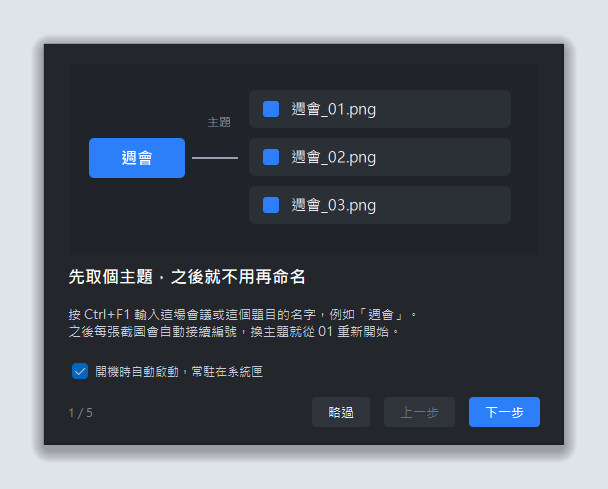
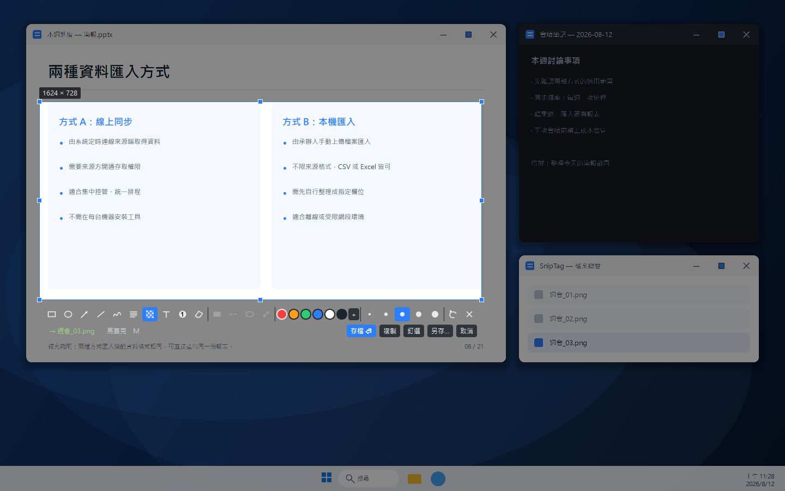

<div align="center">

# SnipTag

**先定主題，再連續截圖 —— 檔名自動接續 `週會_01`、`週會_02`、`週會_03`…**

一個常駐系統匣的 Windows 截圖工具。框選、標註、釘圖一應俱全，
而且把「開會時連續截圖、每張都要重新命名」這件事整個拿掉。

[](https://www.python.org/)
[](https://doc.qt.io/qtforpython/)
[](#系統需求)
[](LICENSE)
[](https://apps.microsoft.com/detail/9PG3Z9PBD542?hl=zh-tw&gl=TW&ocid=pdpshare)

**[SnipTag 已在 Microsoft Store 上架：立即安裝](https://apps.microsoft.com/detail/9PG3Z9PBD542?hl=zh-tw&gl=TW&ocid=pdpshare)**


</div>

---

## 這個工具在解決什麼

一場線上會議，簡報一頁一頁換，你想把每一頁都留下來。

用一般的截圖工具，流程是這樣的：**框選 → 存檔對話框 → 想檔名 → 打字 → 選資料夾 → 存檔**。
一場會議三十張，光是命名就打了三十次字，而且事後看到 `擷取畫面 2026-08-12 143052.png`
根本認不出哪張是哪張。

SnipTag 把這段砍成一個動作：

```
Ctrl+F1  設定主題 → 輸入「週會」

Shift+F1 框一下 → 週會_01.png   ← 放開滑鼠的瞬間就存好了
Shift+F1 框一下 → 週會_02.png
Shift+F1 框一下 → 週會_03.png
```

沒有對話框、沒有打字、不用選資料夾。整場會議就是「框、放、框、放」。

> 「週會」只是這裡的範例。主題就是**你自己隨手取的任何名字** ——
> 中英文、數字、空白都可以，換個主題編號就從 `01` 重新開始。

---

## 主要功能

|  | 功能 | 說明 |
| :-: | --- | --- |
| 🏷️ | **主題式自動命名** | 設定一次主題，之後每張截圖自動接續編號 |
| ⚡ | **零對話框存檔** | `Shift+F1` 放開滑鼠即存檔，工具列也會先告訴你下一張叫什麼 |
| 🧮 | **編號掃描資料夾決定** | 不是記在設定檔，所以換主題、重開程式、刪檔都不會亂 |
| ✏️ | **標註工具** | 矩形、橢圓、箭頭、直線、畫筆、螢光筆、馬賽克、文字、序號 |
| 🖐️ | **標註可再編輯** | 畫完還能點選、搬移、改色、刪除，不只是一路復原 |
| 🪟 | **輔助框自動偵測** | 滑鼠移到哪就框住哪，連視窗裡的子區塊都認得，點一下即選取 |
| 🎨 | **取色器** | 放大鏡顯示色碼，`C` 複製，`Shift` 切換 HEX / RGB / HSL |
| 🕘 | **截圖歷史** | 最近 30 張隨時叫回來重新存檔、複製、釘選 |
| 🔍 | **像素放大鏡** | 顯示游標座標與該點色碼，方便精準對齊 |
| 📌 | **釘圖到桌面** | 把截圖釘在最上層，可縮放、調透明度，對照資料很好用 |
| 🖥️ | **混合 DPI 多螢幕** | 筆電 200% + 外接 100% 也不偏移，各自以原生解析度存檔 |
| ⌨️ | **全域熱鍵** | 任何程式在前景都能觸發，熱鍵可自訂 |
| ⏱️ | **延時／重複截圖** | 延時 3–5 秒讓你先叫出選單，或用上次的範圍再拍一次 |
| 🖼️ | **輸出效果** | 圓角、陰影、外框，貼進文件或簡報直接就很好看 |
| 🚀 | **開機自動啟動** | 設定裡勾一下就常駐，不需要系統管理員權限 |
| 📦 | **純本機執行** | 沒有網路連線、沒有帳號、沒有雲端，設定就一個 JSON |

---

## 安裝

### 系統需求

- Windows 10 / 11
- Microsoft Store 版不需要另外安裝 Python
- 從原始碼執行需要 Python 3.10 以上

> 全域熱鍵與視窗偵測使用 Win32 API。在 macOS / Linux 上程式仍可啟動，
> 但熱鍵與視窗自動偵測不會作用。

### 推薦：從 Microsoft Store 安裝

[前往 Microsoft Store 安裝 SnipTag](https://apps.microsoft.com/detail/9PG3Z9PBD542?hl=zh-tw&gl=TW&ocid=pdpshare)

- 由 Microsoft Store 簽署與發佈
- 可透過 Microsoft Store 自動更新
- 避免直接下載未簽章執行檔時出現的 SmartScreen 警告

Microsoft Store ID：`9PG3Z9PBD542`

### 從原始碼執行（開發者）

```bash
git clone https://github.com/and910805/SnipTag.git
```

```bash
cd SnipTag
```

```bash
pip install -r requirements.txt
```

### 啟動

```bash
python -m sniptag
```

或直接雙擊 **`run.bat`** —— 用 `pythonw` 啟動，不會留一個黑色 console 視窗。

啟動後會常駐在系統匣，右鍵圖示即可叫出所有功能。

### 開機自動啟動

**系統匣圖示右鍵 → 勾選「開機時自動啟動」** 即可，馬上生效。
第一次啟動的使用教學最後一頁、以及「設定…」裡也都有同一個選項。

它寫的是目前使用者的登錄檔啟動項
（`HKCU\Software\Microsoft\Windows\CurrentVersion\Run`），
不需要系統管理員權限，也不會影響這台電腦的其他使用者。
勾選框旁的提示會顯示實際會執行的命令。

登錄檔是唯一真相 —— 你若從工作管理員的「開機」分頁停用它，
設定視窗下次打開就會顯示成未勾選。

> 用 exe 版的話，**搬動 `SnipTag.exe` 的位置之後要重新勾選一次**，
> 因為啟動項記的是當初那個路徑。

---

## 第一次啟動

會跳出一份五頁的使用教學，把核心流程講完 —— 主題命名、兩種截圖方式、
標註、釘圖與歷史。最後一頁可以直接勾選開機自動啟動，關掉之後會請你設定第一個主題。



之後想再看一次，從系統匣圖示右鍵選「使用教學…」即可。

---

## 快速上手

**1. 設定這場會議的主題** —— 按 `Ctrl+F1`，輸入 `週會`。
對話框會即時告訴你下一張會存成什麼。


**2. 開始截圖** —— 按 `Shift+F1`，框一下，放開滑鼠。檔案已經存好了。

想先確認再存的話按 `F1`，工具列左邊會顯示 `→ 週會_03.png`，按 `Enter` 存檔。

**3. 換一場會議** —— 再按 `Ctrl+F1` 換個主題，編號自動從 `01` 重新開始。

---

## 使用畫面

### 框選中：暗化背景、即時尺寸、像素放大鏡

放大鏡顯示游標座標與該點色碼，尺寸標籤顯示的是**實際會存下來的像素數**。


### 框選完成：工具列直接告訴你檔名

左下角的 `→ 週會_03.png` 就是按下「存檔」後的結果。框好之後還能拖曳邊角調整、整塊搬移。


### 標註：矩形、箭頭、螢光筆、馬賽克、文字

上排選工具與顏色粗細，畫錯了 `Ctrl`+`Z` 復原。標註是向量繪製，
輸出時才畫到原生解析度上，所以在高 DPI 螢幕也不會糊。


### 輔助框：滑鼠移過去，點一下就好

不用手動對齊邊界。範圍會**淡藍色高亮**並標出實際像素數，一眼就看得到框到哪裡。
預設框整個視窗，**滾輪往下可以鑽進視窗裡的子區塊**，往上再退回來。


### 釘圖：把截圖釘在桌面最上層

滾輪縮放、`Ctrl`+滾輪調透明度，對照兩份資料時很方便。


### 截圖歷史：剛剛那張手滑關掉了也救得回來

最近 30 張都留著，可以重新存檔（一樣自動命名）、複製或釘選。
只放在記憶體裡，關掉程式就清空 —— 這是給「手滑」用的，不是備份機制。


### 設定


> 以上畫面由 [`docs/make_screenshots.py`](docs/make_screenshots.py) 產生，
> 內容是合成的假桌面，任何人重跑都會得到一樣的圖。

---

## 熱鍵

| 熱鍵 | 功能 |
| --- | --- |
| `F1` | 框選截圖，放開滑鼠後出現工具列 |
| `Shift+F1` | **快速截圖：放開滑鼠直接存檔**，不出工具列 |
| `Ctrl+Shift+F1` | 用**上次的框選範圍**再拍一次 |
| `F3` | 把剪貼簿裡的圖釘到桌面 |
| `Shift+F3` | 一鍵隱藏／顯示所有釘圖 |
| `Ctrl+F1` | 切換主題 |

系統匣選單另外有**延時 3／5 秒截圖**（要先叫出下拉選單再拍時很好用）
與**擷取作用中視窗**。

熱鍵可在「設定…」裡改 —— **點一下欄位後直接按下想要的組合鍵**即可錄製，不用自己打字，
`Esc` 清空代表停用該熱鍵。按下 OK 立即生效，不需要重新啟動。

### 框選中

| 操作 | 說明 |
| --- | --- |
| 拖曳 | 框出範圍 |
| `Shift`+拖曳 | 框成正方形 |
| 直接點一下 | 選取輔助框框住的範圍 |
| 滾輪 | 往下鑽進視窗裡的子區塊，往上退回整個視窗 |
| 拖曳邊角 / 中間 | 框好之後調整大小、整塊搬移 |
| 方向鍵 | 微調：未框好時逐像素移動游標，框好後移動選取範圍 |
| `Ctrl`+方向鍵 / `Shift`+方向鍵 | 放大 / 縮小選取範圍（加 `Alt` 一次 10 像素） |
| `C` | 複製游標下的色碼 |
| `Shift` | 切換色碼格式（HEX / RGB / HSL） |
| `Ctrl`+`A` | 選取整個桌面 |
| `Enter` / `S` / 雙擊 | 自動命名存檔 |
| `Ctrl`+`C` | 複製到剪貼簿 |
| `F` | 釘到桌面 |
| `Ctrl`+`S` | 另存新檔（會跳對話框） |
| `Esc` | 取消 |

### 標註工具

框好之後才會出現。選了工具之後，在框選範圍內拖曳即可繪製。

| 熱鍵 | 工具 | 說明 |
| --- | --- | --- |
| `R` | 矩形 | 框住重點 |
| `O` | 橢圓 | 圈起來 |
| `A` | 箭頭 | 指向某處 |
| `L` | 直線 | |
| `P` | 畫筆 | 自由手繪 |
| `H` | 螢光筆 | 半透明加寬，底下的字還看得見 |
| `M` | 馬賽克 | 打散不想被看清的區域（**不適合機敏資訊**，見下方說明） |
| `T` | 文字 | 點一下輸入，`Enter` 完成；開「填滿」會加上底色 |
| `N` | 序號 | 點一下蓋一個 ①，自動遞增 |
| `E` | 橡皮擦 | 拖曳擦掉碰到的標註 |

工具列全部使用圖示，**滑鼠停上去，工具列左下角就會寫出那是什麼功能與快捷鍵**：




除了顏色（六個常用色 + `＋` 自訂）與五段粗細，還有四個樣式開關：
**填滿**、**虛線**、**圓角**（矩形）、**雙向**（箭頭）——
只有適用於目前工具的開關會亮起來。

**畫完還能改**：不選任何工具的狀態下，點一下已完成的標註就會選取它
（外圍出現虛線框），可以拖曳搬移、按 `Delete` 刪除，或直接換顏色與粗細。
`Ctrl`+拖曳會複製一份。每個工具還會各自記住自己的顏色 ——
畫完紅框切到螢光筆，不會突然變成紅色螢光筆。

| 熱鍵 | 功能 |
| --- | --- |
| `Ctrl`+`Z` | 復原 |
| `Ctrl`+`Shift`+`Z` / `Ctrl`+`Y` | 重做 |
| 方向鍵 | 微調選中標註的位置 |
| `Delete` | 刪除選中的標註 |
| `Esc` | 取消選取 → 取消工具 → 結束截圖（依序） |

標註是**向量繪製**，輸出時才畫到原生解析度上，所以線條在高 DPI 螢幕上不會糊掉，
馬賽克也是取原始像素重新運算。

### ⚠️ 遮蔽機敏資訊請用純色，不要用馬賽克

存出來的檔案裡**沒有**藏著原圖 —— 馬賽克區域的像素是真的被換掉的，
測量下來該區的相異顏色數從 440 降到 25，而且 PNG 檔案裡找不到原始文字的任何痕跡。

但**馬賽克本質上不是安全的遮蔽手段**。每個色塊的值仍然是由底下的原始像素算出來的，
對於「已知字型的文字」這種低變化量的內容，攻擊者可以窮舉各種可能的文字、
算出同樣的馬賽克來比對，進而還原內容（`Depix` 這類工具就是在做這件事）。

**要真正遮掉密碼、身分證號、金鑰這類東西，請用「矩形 + 填滿」蓋成純色。**
純色填滿不帶有底下內容的任何資訊，是不可逆的。

馬賽克適合的是「看起來雜亂就好」的場合 —— 例如遮掉同事的頭像、無關的檔名列表。

### 釘圖視窗

| 操作 | 說明 |
| --- | --- |
| 拖曳 | 移動 |
| 滾輪 / `+` `-` | 縮放 |
| `Ctrl`+滾輪 | 調透明度 |
| `1` / `2` | 向左 / 向右旋轉 90° |
| `3` / `4` | 水平鏡像 / 垂直翻轉 |
| `5` / `6` | 灰階 / 反相 |
| `T` | 切換是否維持最上層（關掉後邊框變灰） |
| `D` | 只顯示這一張，其餘暫時收起來 |
| `X` | **滑鼠穿透** —— 圖留在最上層，但點擊會穿到底下的視窗 |
| `Alt`+`C` | 複製游標下的色碼 |
| `Ctrl`+`C` / `Ctrl`+`S` | 複製 / 存檔 |
| `Ctrl`+`0` | 回到原始大小、角度與不透明 |
| 右鍵 | 完整選單 |
| 雙擊 / 中鍵 / `Esc` | 關閉 |

> 開了滑鼠穿透之後，那張圖就收不到鍵盤與滑鼠了 —— 邊框會變成橘色提醒你。
> 要救回來請用系統匣選單的「解除所有滑鼠穿透」。

---

## 檔名樣板

預設樣板是 `{topic}_{n:02d}`，可在設定裡改。

| 欄位 | 產出 |
| --- | --- |
| `{topic}` | 目前主題，例如 `週會` |
| `{n}` | 流水號。`{n:02d}` → `01`、`{n:03d}` → `001` |
| `{date}` | `20260812` |
| `{date2}` | `08-12` |
| `{time}` | `143005` |
| `{datetime}` | `20260812_143005` |

常見組合：

| 樣板 | 結果 |
| --- | --- |
| `{topic}_{n:02d}` | `週會_01.png` |
| `{date2}_{n:02d}` | `08-12_01.png`（用日期當主題） |
| `{date}_{topic}_{n:03d}` | `20260812_週會_001.png` |

### 編號怎麼決定的

**掃描目的資料夾算出來的，不是記在設定檔裡。** 所以：

- 換主題 → 新主題自動從 `01` 開始
- 關掉程式再開 → 接著原本的號碼往下走
- 手動刪掉中間某張 → **不回填空號**，永遠接在最大號之後，不會蓋掉既有檔案
- 手動搬走整批檔案 → 下次自動從 `01` 重來

打開「每個主題各開一個子資料夾」後，會存成 `<存檔資料夾>/週會/週會_01.png`。

---

## 多螢幕與混合 DPI

支援不同縮放比例的螢幕混用 —— 例如筆電 200% 搭配外接螢幕 100%。

程式會用 Windows 的顯示裝置名稱（`\\.\DISPLAY1`）把 Qt 螢幕和 Win32 螢幕配對起來，
每台螢幕各自保留「邏輯座標 ↔ 實體像素 ↔ 縮放比」的對應關係，**不使用單一全域縮放比**。
插拔外接螢幕不需要任何設定：

- 每張截圖以該螢幕的**原生解析度**存檔，不會糊掉也不會被放大
- 框選跨越兩台螢幕時，以較高解析度那台為基準拼接
- 視窗自動偵測在兩台螢幕上都對得準

這段邏輯有獨立測試，用模擬的螢幕組態驗證，不需要真的接上外接螢幕。

---

## 設定檔

`%APPDATA%\SnipTag\config.json`

```json
{
  "save_dir": "C:\\Users\\<you>\\Pictures\\SnipTag",
  "topic": "週會",
  "template": "{topic}_{n:02d}",
  "format": "png",
  "subfolder_per_topic": false,
  "copy_on_save": true,
  "notify_on_save": true,
  "hotkey_capture": "F1",
  "hotkey_quickshot": "Shift+F1",
  "hotkey_pin": "F3",
  "hotkey_topic": "Ctrl+F1"
}
```

---

## 專案結構

```
sniptag/
├─ __main__.py    進入點，設定 High-DPI 政策後啟動
├─ app.py         主控制器：系統匣、熱鍵綁定、截圖流程、存檔
├─ config.py      設定讀寫
├─ naming.py      主題 + 流水號 → 檔名（掃描資料夾決定編號）
├─ screens.py     桌面擷取、逐螢幕 DPI 換算（DesktopShot）
├─ winrects.py    列舉可見視窗與子區塊（EnumWindows / EnumChildWindows + DWM）
├─ overlay.py     全螢幕框選介面
├─ annotate.py    標註圖形與圖層（含命中測試、復原）
├─ toolicons.py   工具列圖示（程式畫出來的，沒有資源檔）
├─ effects.py     輸出效果：圓角、陰影、外框
├─ history.py     截圖歷史與瀏覽面板
├─ welcome.py     第一次啟動的使用教學
├─ pinwindow.py   釘圖視窗
├─ dialogs.py     主題 / 設定視窗
├─ hotkeys.py     全域熱鍵（RegisterHotKey + native event filter）
├─ autostart.py   開機自動啟動（HKCU 的 Run 機碼）
└─ icon.py        程式內畫出來的圖示
```

核心抽象是 `screens.DesktopShot`：一次桌面擷取的結果，內含整個虛擬桌面的實體像素，
以及每台螢幕的座標對應。所有「邏輯座標 ↔ 實體像素」的換算都經過它，
其他模組不需要知道 DPI 的存在。

---

## 開發

### 測試

```bash
python test_naming.py
```

```bash
python test_dpi.py
```

```bash
python test_annotate.py
```

```bash
python test_history.py
```

```bash
python test_hotkeys.py
```

```bash
python test_autostart.py
```

```bash
python test_effects.py
```

```bash
python test_welcome.py
```

- `test_naming.py` —— 命名與編號邏輯（換主題、刪檔、樣板、非法字元）
- `test_dpi.py` —— 用模擬的雙螢幕組態（1440×900@200% + 1920×1080@100%）
  驗證座標換算與裁切解析度，不需要真的接上外接螢幕
- `test_annotate.py` —— 標註是否精準落在輸出影像的對應位置、命中測試
  （空心圖形只認邊框）、搬移、橡皮擦、樣式變化、序號遞增、色彩格式，
  以及馬賽克的遮蔽行為
- `test_history.py` —— 歷史的上限與順序、縮圖、面板動作轉派
- `test_hotkeys.py` —— 組合鍵解析，以及錄製欄位（只按修飾鍵不覆寫、`Esc` 清空）
- `test_autostart.py` —— 啟動命令的組成與登錄檔讀寫。用測試專用的值名稱，
  跑完會還原，不會動到你真正的啟動項
- `test_effects.py` —— 圓角是否真的把角落切成透明、陰影外擴的尺寸與方向
- `test_welcome.py` —— 教學的頁面導覽、邊界（第一頁不能再往前）與示意圖繪製

### 重新產生文件截圖

```bash
python docs/make_screenshots.py
```

### 打包成單一 exe

```bash
pip install pyinstaller
```

```bash
pyinstaller --noconsole --onefile --name SnipTag run.py
```

### 建立 Microsoft Store MSIX

Partner Center 使用的套件身分已放在 `packaging/AppxManifest.xml.template`。
執行下列指令會先建立 exe，再下載 Microsoft 官方 Windows SDK 建置工具，
最後產生 `dist/SnipTag_<版本>_x64.msix`：

```powershell
pip install -r requirements.txt pyinstaller
python build_msix.py
```

如果 `dist/SnipTag.exe` 已經建好，可以略過重複打包：

```powershell
python build_msix.py --skip-exe
```

產生的 MSIX 沒有本機簽章，僅用來上傳 Microsoft Partner Center；認證通過後，
Microsoft Store 會重新簽署並提供安裝與自動更新。不要把 unsigned MSIX 當作一般下載檔發布。

正式上架頁面：[SnipTag — Microsoft Store](https://apps.microsoft.com/detail/9PG3Z9PBD542?hl=zh-tw&gl=TW&ocid=pdpshare)

Store 版的開機啟動由 MSIX `windows.startupTask` 管理，不把版本化的
`WindowsApps` 路徑寫進登錄檔。使用者可在工作管理員的「啟動應用程式」頁面停用。

---

## 關於 GitHub 直接下載版的 Windows 警告

一般使用者建議直接從 [Microsoft Store](https://apps.microsoft.com/detail/9PG3Z9PBD542?hl=zh-tw&gl=TW&ocid=pdpshare)
安裝。Store 版本由 Microsoft Store 簽署與發佈，並支援自動更新。

GitHub Release 目前發布的 `SnipTag.exe` **尚未具有受信任的程式碼簽章**，所以 Windows
SmartScreen、Smart App Control 或防毒軟體可能會攔下來，說「不知道是誰開發的」。

exe 裡面有寫入完整的檔案內容資訊（產品名稱、版本、著作權、專案網址），
右鍵 →「內容」→「詳細資料」看得到，但那只是**描述**，不是**證明** ——
任何人都能填一樣的欄位，所以系統不會因此就信任它。

### Code signing policy

> **申請狀態：審核中。** 在 SignPath 核准且簽署流程正式接入前，Release 內的
> 執行檔仍是未簽章版本，Windows 可能繼續顯示警告。

核准後，Windows Release 將使用以下服務簽署：

> Free code signing provided by [SignPath.io](https://signpath.io/), certificate by
> [SignPath Foundation](https://signpath.org/).

- Committers and reviewers: [@and910805](https://github.com/and910805)
- Approvers: [@and910805](https://github.com/and910805)

外部貢獻必須經過維護者審查後才會合併；每次正式 Release 的簽署請求也必須由
維護者人工核准。只有由本專案公開原始碼與建置腳本，透過 GitHub Actions 產生的
SnipTag 發佈成品可以送交簽署。

**Privacy:** This program will not transfer any information to other networked systems
unless specifically requested by the user or the person installing or operating it.

### 你可以怎麼確認這個檔案沒被動過手腳

每個 release 都會附上 `SnipTag.exe.sha256`。下載後比對：

```powershell
Get-FileHash .\SnipTag.exe -Algorithm SHA256
```

對得上就表示你拿到的，就是 GitHub Actions 從這個 repo 的原始碼建出來的那一份
（建置紀錄是公開的，可以在 Actions 頁面查到是哪個 commit 建的）。

### 最保險的做法：自己建

不想信任任何預先建好的檔案，就自己跑一次：

```bash
pip install -r requirements.txt pyinstaller
```

```bash
python build.py
```

或者乾脆不要 exe，直接用原始碼執行（`python -m sniptag`）——
Python 直譯器本身是有簽章的，通常不會被攔。

### 如果要在公司或機關內部發放

- 請 IT 用雜湊值或路徑加入白名單，這是最直接的
- 或由單位申請組織用的簽章憑證，簽過之後用群組原則佈署信任
- 若是被 Defender 誤判，可以到微軟的檔案提交頁面申請重新分析

> 已啟用 **Smart App Control** 的機器比較特別：它要求檔案有足夠的信譽或
> 受信任的簽章，自己做的自簽憑證幫不上忙。那種情況請直接用原始碼執行。

---

## 常見問題

**熱鍵沒反應？**
多半是被別的截圖工具佔用了 —— 這類程式常常也綁在 `F1` / `F3`。
SnipTag 啟動時會跳通知告訴你哪幾個熱鍵註冊失敗，到「設定…」換一組即可。

**編號會不會蓋掉舊檔案？**
不會。編號是掃描資料夾取最大值 +1，而且寫入前會再檢查一次檔案是否存在。

**可以用日期當主題嗎？**
可以，把樣板改成 `{date2}_{n:02d}` 就會存成 `08-12_01.png`，每天自動換一組編號。

**截圖會不會被壓縮？**
不會。預設 PNG 無損，且以螢幕原生解析度存檔。需要小一點的檔案可以在設定裡改成 JPG。

**馬賽克可以用來遮密碼嗎？**
**不建議。** 存出來的檔案確實沒有藏原圖，但馬賽克的色塊是從原始像素算出來的，
對已知字型的文字有機會被反推還原。機敏資訊請用「矩形 + 填滿」蓋純色。
詳見上面的[遮蔽說明](#️-遮蔽機敏資訊請用純色不要用馬賽克)。

**標註畫完之後還能修改嗎？**
可以搬移、複製、改色、改粗細、刪除 —— 不選任何工具時點一下該標註即可，
`Ctrl`+拖曳會複製一份。但**還不能拉伸改變大小或旋轉**，
需要調整尺寸的話請 `Ctrl`+`Z` 重畫。

**工具列上的圖示是什麼意思？**
滑鼠停在任何一個圖示上都會顯示名稱與快捷鍵。
圖形工具用圖形表示，掃一眼就找得到，不用讀字。

---

## Privacy

SnipTag 在本機處理截圖、剪貼簿內容與設定，不包含遙測或使用情形分析。
詳情請參閱 [Privacy Policy / 隱私權政策](PRIVACY.md)。

---

## License

This project is licensed under the [MIT License](LICENSE).
